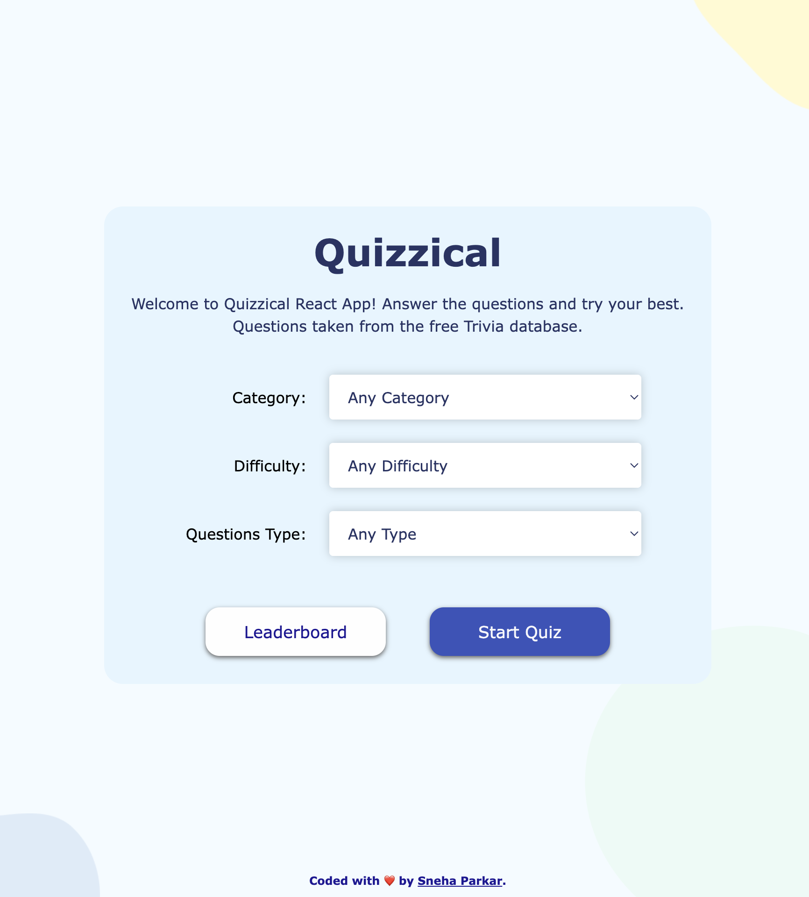
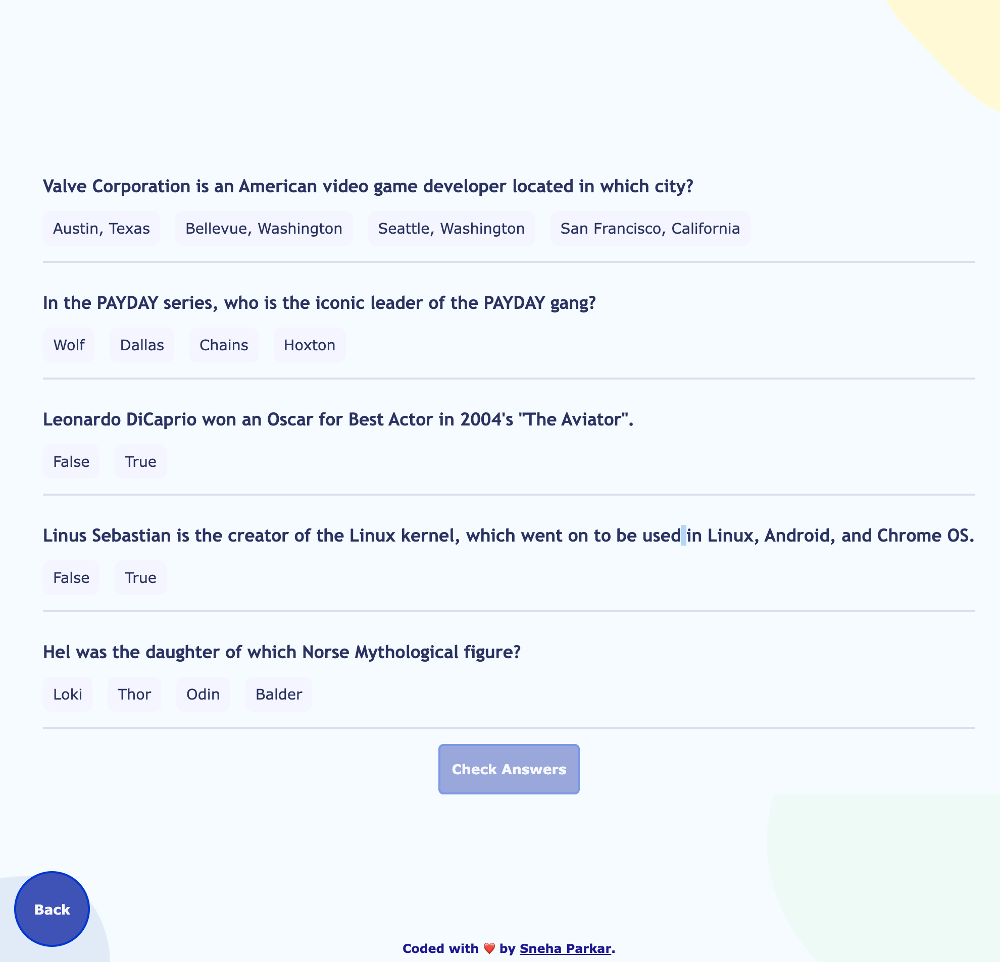
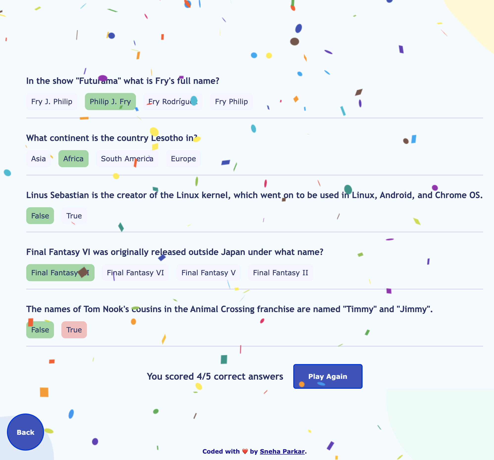
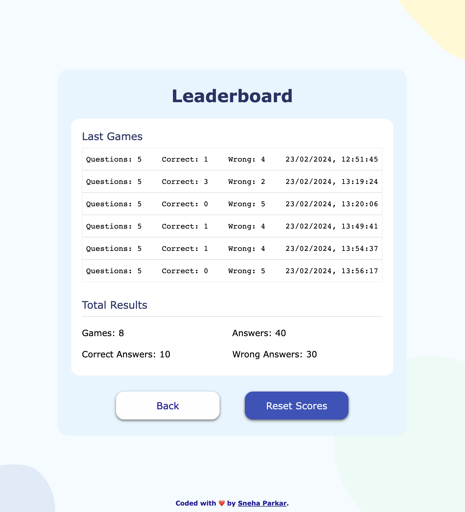

# Quizzical App (Scrimba React Course section 4 project)
A React web-app Trivia Game! My final solo project completely made from scratch as part of Scrimba's Learn React for Free Course 

Trivia Questions API: <a href=" https://opentdb.com/api_config.php">https://opentdb.com/api_config.php</a>

### Requirements

- useState, useEffect
- Use .map() and props
- Conditional Rendering
- Styled & polished

### Screenshot
<b> Start Option Screen</b>

<b>Quiz Screen</b>

<b>Leaderboard </b>

### Getting Started with Create React App

This project was bootstrapped with [Create React App](https://github.com/facebook/create-react-app).

## Available Scripts

If you want to see the final product, in the project directory, you can run:

## `npm start`

Runs the app in the development mode.\
Open [http://localhost:3000](http://localhost:3000) to view it in your browser.

### Built with

- Semantic HTML5 markup
- CSS custom properties
- Javascript
- React.JS

## Author

- Website - [sneha parkar](https://snehaparkar.in)
